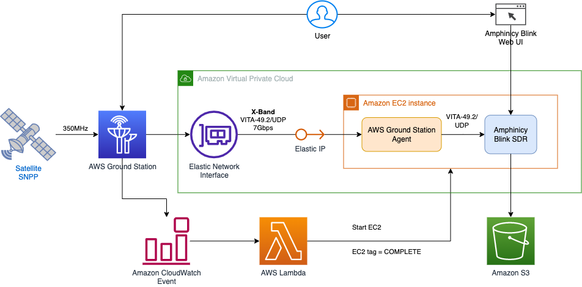
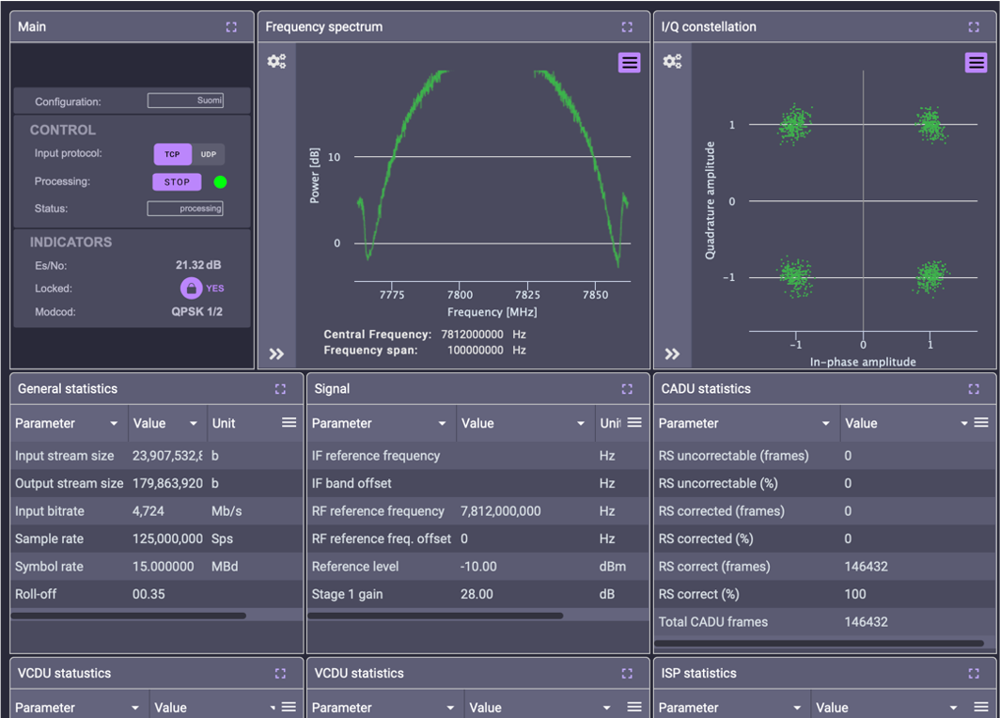

# Deployment guidelines

The repository contains artefacts, necessary to deploy the solution, described in AWS Blog post "Building high-throughput satellite data downlink architectures with AWS Ground Station WideBand DigIF and Amphinicy Blink SDR".

Below you can see an architecture of the solution:



The AWS CloudFormation template `ga-snpp-wb-ec2-poc-latest.yml`, available in the repository, deploys all components of the architecture, except of the Amazon S3 bucket, which users need to create in advance.

## Pre-requisites

* You need to have an AWS account already onboarded to AWS Ground Station as described in <https://docs.aws.amazon.com/ground-station/latest/ug/customer-onboarding.html>

* Have necessary credentials, allowing you to use AWS Ground Station, AWS Marketplace, to create a S3 bucket, and to deploy AWS CloudFormation stacks.

* Clone the repo on a machine with installed shell (e.g. `bash`), `tar`, and `zip`.

## Build binaries

Build binary artifacts (automation scripts and Blink configuration)

```bash
make
```

After the build you should get two archives:

* `./dist/blink_config_bundle.zip`
* `./dist/automation_bundle.zip`

## Create an S3 bucket

Create a S3 bucket `<s3-bucket-name>` and upload there the two archives from above.

## AWS Marketplace

* Contact <mail:awsmarketplace@amphinicy.com> to obtain a private offer from Amphinicy to use Amphinicy Blink Modem. You should do it to obtain a better deal, that the list price on the product page.

* Accept the Amphinicy’s Private offer on the AWS Marketplace for the “Software-Based Satellite Modem - Blink AMI”.

* We advise users, who want to use the latest version of Amphinicy Blink in the deployment, to find the AMI id of the latest Amphinicy Blink version in AWS Marketplace. Open AWS Console, then open "AWS Marketplace", go to "Manage subscriptions", click "Software-Based Satellite Modem - Blink AMI", click "Launch new instance", chose your deployment region in the "Region" field, and note the "AMI ID" in the bottom of the dialog. Then press "Cancel" or close the AWS Marketplace window. Put the noted AMI ID into the respective region map entry in the `BlinkMap` section (lines 126-148) of the AWS CloudFormation template `ga-snpp-wb-ec2-poc-latest.yml` in the repository.

## Instance Quota

The Amphinicy Blink Modem requires an EC2 instance, equipped with GPUs. The AWS Ground Station Agent supports [selected set of instance types](https://docs.aws.amazon.com/ground-station/latest/ug/agent-requirements.html).

Before the deployment, you need to request a quota increase for the recommended G4 instance type. You’re going to be using `g4dn.metal` instance (we tested the solution with this instance type), which has 8 GPUs and 96 Virtual CPUs. Request a quota increase to 96 vCPU for "Running On-Demand G and VT instances" using the Service Quotas console <https://console.aws.amazon.com/servicequotas/home/services/ec2/quotas/>.

Note, that you need separate quota increase request for each region where you plan to deploy Blink SDR. We suggest you use the N. Virginia (us-east-1) or Ireland (eu-west-1) regions for this test deployment.

## Choosing Availability Zones

The `g4dn.metal` instance type is not available in all regions and availability zones. You will still need to select the availability zone that corresponds to your VPC Subnet for deployment. To find which availability zones have `g4dn.metal` instances do the following:

1. Open the Amazon EC2 console.
2. Choose the Region where you want to launch the instance.
3. Select Instance Types in the left-hand side menu bar.
4. For Filter instance types, enter your preferred instance type. (`g4dn.metal`)
5. Select your preferred instance type.
6. Under Networking, review the Availability Zones listed under Availability Zones. Note these down.

Once you know the availability zones you need to match them to a subnet. Do the following:

7. Open the VPC console
8. Select the Region where you want to launch the instance.
9. Select Subnets from the left-hand side list.
10.	From the list of subnets see which ones correspond to the availability zones from above. You will have to slide the window to the right.
11. Please note a public subnet in the availability zone - you will deploy the resources into the public subnet.

## AWS CloudFormation template deployment

Deploy the AWS CloudFormation template `ga-snpp-wb-ec2-poc-latest.yml` with the following parameters:

```text
Ec2InstanceType: g4dn.metal
VpcId: <your-vpc>
SubnetId: <your-subnet>
SSHKey: <your-ssh-key>
SSHCidrBlock: <your-IP/32>
AutomationBundleS3Path: s3://<s3-bucket-name>/automation_bundle.zip
BlinkConfigBundleS3Path: s3://<s3-bucket-name>/blink_config_bundle.zip
BlinkResultsBucketName: <s3-bucket-name>
```

The stack deployment will take approximately 5 min, followed by provisioning of an EC2 instance, which takes approximately 8 min. During the provisioning, the AWS Ground Station Agent, installed on the instance, registers with the AWS Ground Station service, to make it possible for you to schedule satellite contacts. Therefore you need to wait for the installation process to finish and the EC2 Blink instance to shutdown automatically.

## Connecting to the Blink SDR instance

You can connect to the instance either during the contact window with the satellite (the instance is started automatically in this case), or after you started the instance manually.

The Blink SDR has a web interface for monitoring and control, as well as an SSH management connection.

### Web interface – all operating systems

Connect to the Blink web interface from the SSH CIDR block. Go to a browser and type: `https://<public ip address of EC2 instance>`

Acknowledge the browser certificate warning and continue to the log in page.

There are 2 users:

* `blink-user` (default password: The EC2 instance ID, for example `i-0a44e932eeb18eb6b`) – user with basic roles needed to view the modem’s dashboard and issue minimum number of required operational commands.

* `blink-admin` (default password: The EC2 instance ID, for example `i-0a44e932eeb18eb6b`) – power user with all roles enabled, allowing the user in-depth configuration of Blink’s M&C interface.

It’s good practice to change the default passwords on your first log on.

### SSH Connection - Linux / Mac

Run the command below to connect to the EC2 instance using SSH:

```bash
ssh -i <path to pem file> ubuntu@<public ip address of EC2 instance>
```

### SSH Connection - Windows

Please follow instruction for you SSH client to connect to the provisioned EC2 instance with address `<public ip address of EC2 instance>`, user `ubuntu` using the private SSH key, which you referred to in the AWS CloudFormation stack deployment.

## Scheduling Contacts

Schedule AWS Ground Station contacts with the satellite `37849` and mission profile `<stack-name>: 37849 SNPP 350MHz WBDigIF EC2 Delivery`.

If, during the contact, you connect to the Blink web UI, as described above, you will see the Blink dashboard similar to the one shown below:



After the end of the contact you will get the processed satellite data (CADU) on the Amazon EC2 instance in the directory `/var/blink/out/ACQ_<timestamp>/CADUs/`.

After the end of the contact you will find following artefacts in the S3 bucket `<s3-bucket-name>` (the bucket, which you've specified in the Cloud Formation template parameters during the deployment):

* `<s3-bucket-name>/Blink/<yyyy-mm-dd>/` - Blink contact report
* `<s3-bucket-name>/Logs/<yyyy-mm-dd>/<hh-mm-ss>/` - syslog, Ground Station Agent logs, and Blink logs

If you want to upload additional artefacts (e.g. CADUs) to S3 after the end of the contact, you can add the respective code into `modem_ami/config_service/stop.sh:38` or into `sdr-contact-completed.sh:18`.

## Data visualization

As an extra step, users can modify the setup to visualize the satellite data in real-time during the contact with the NASA software Simulcast.

Following the Simulcast manual `s3://space-solutions-eu-west-1/software/SIMULCAST/Simulcast_7.0_Users_Guide.pdf` you can install the Simulcast software from `s3://space-solutions-eu-west-1/software/SIMULCAST/SIMULCAST_7.0.tar.gz` on the EC2 instance with Blink or on another EC2 instance reachable over TCP from the Blink EC2 instance.

To enable Blink streaming data to Simulcast you need to:

* start the Blink EC2 instance;
* uncomment final streaming section in `/etc/blink/fep-rx/Suomi-data.xml` mission configuration file on the Blink instance with a text editor. Please make sure the streaming points to an IP address of the machine, where Simulcast is running;
* stop the Blink EC2 instance.

Now you can schedule a new contact with AWS Ground Station and observe on the Simulcast's screen a visualisation, similar to the one shown below.


